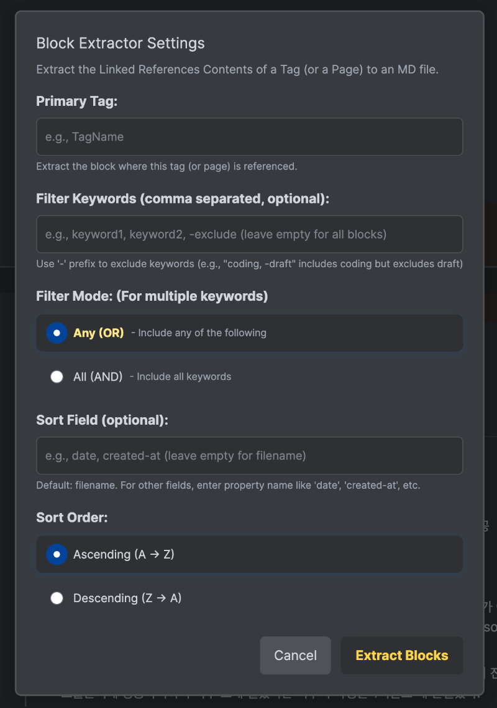

### [ENGLISH](README.md)

# Block Extractor Plugin for Logseq


   


## 개요

**Block Extractor**는 Logseq 페이지 하단의 **"Linked References" 내용을 Markdown 파일로 내보내는** 플러그인입니다. 태그(또는 페이지)와 선택적 필터 키워드를 입력하면, 해당 태그를 참조하는 모든 블록을 계층 구조 그대로 수집·필터링·정렬하여 `.md` 파일로 다운로드합니다.

> **개인적인 의견:**
> Logseq를 쓰는 가장 큰 이유인 "Linked References"는 정작 그 내용을 통째로 추출할 방법이 없습니다. 이 플러그인은 백링크로 쌓아온 기록 중 필요한 부분만 골라 가볍게 내보내기 때문에, 공유하기도 편하며 AI 분석 활용시 더 적은 토큰 비용으로 이용할 수 있습니다.  

---



## 기능

- **태그 기반 추출** — 기본 태그(또는 페이지)를 참조하는 모든 블록을 수집합니다(대소문자 무관). 하위 블록은 10계층까지 계층 구조를 유지하며, 태그 페이지 원본 본문도 함께 추출할 수 있습니다.
- **키워드 필터링** — 쉼표로 구분한 키워드를 **Any**(OR)/**All**(AND) 조건으로 필터링하고, 키워드 앞에 `-`를 붙이면 제외 필터로 동작합니다.
- **정렬** — 페이지 이름(기본값) 또는 그래프에서 사용 중인 모든 property 기준으로 오름차순/내림차순 정렬합니다.
- **유연한 링크 서식** — 기본값으로 `[[링크]]`가 **볼드체**로 변환됩니다. 원하는 기호를 직접 입력하거나, `[[ ]]` 원본 문법을 유지하거나, **Plain text** 토글로 괄호를 완전히 제거할 수 있습니다.
- **깔끔한 Markdown 출력** — `logseq.order-list-type:: number` 같은 Logseq 고유 메타데이터를 자동 제거하고 표준 Markdown으로 변환하여, 어떤 에디터에서도 그대로 열 수 있습니다.
- **완전한 키보드 워크플로우** *(New in 2.0)* — 열기부터 추출까지 마우스 없이 완결됩니다. 아래 [단축키 표](#키보드-단축키)를 참고하세요.
- **마지막 설정 기억** *(New in 2.0)* — 모든 입력값이 저장되어 다음에 그대로 미리 채워집니다. "열기 → `Cmd/Ctrl+Enter`" 두 동작이면 직전 추출이 재실행됩니다. 첫 사용 시엔 현재 페이지가 태그 기본값이 됩니다.
- **컴팩트한 다이얼로그** *(New in 2.0)* — 사용 빈도가 낮은 옵션은 **Advanced** 섹션으로 접혀 있고(요약 칩으로 현재 설정 표시), 내보낼 파일명이 하단에 실시간으로 미리 표시됩니다.
- **자동완성** — 태그·키워드 입력창은 페이지 이름을(두 글자 이상, 한국어 등 지원), Sort By 입력창은 property를 제안합니다.
- **다양한 실행 방법** — 단축키, 커맨드 팔레트, 슬래시 명령어(`/Extract Filtered Blocks`), 툴바 버튼, 블록 우클릭 메뉴.
- **테마 지원** — 모든 색상이 Logseq 테마 변수를 따르므로 라이트/다크/커스텀 테마와 자연스럽게 어울립니다.

## 설치 방법

Logseq 플러그인 마켓플레이스에서 **logseq-block-extractor**를 검색하여 설치합니다.

> 참고: 이 플러그인은 현재 파일 기반(Markdown) 그래프만 지원합니다.(Logseq에서 개발중인, DB 기반 그래프는 지원하지 않습니다.)

---

## 사용법

1. **다이얼로그 열기** — **`Cmd+Shift+E`**(macOS) / **`Ctrl+Shift+E`**(Windows/Linux)를 누르거나, 커맨드 팔레트·슬래시 명령어(`/Extract Filtered Blocks`)·툴바 버튼·블록 우클릭 메뉴를 사용합니다.
   - 다이얼로그는 마지막 사용 설정이 미리 채워진 채 열립니다. 태그는 전체 선택되어 있어 바로 타이핑하면 교체되고, 그대로 `Cmd/Ctrl+Enter`를 누르면 직전 추출이 재실행됩니다.
2. **입력하기** (모든 텍스트 입력창은 자동완성을 지원합니다):
    - **Primary Tag (필수)** — 검색할 태그 또는 페이지 이름. 하나만 입력하며 `#` 기호는 붙이지 않습니다. 예: `projectX`
    - **Filter Keywords (선택)** — 쉼표로 구분한 키워드. 비워두면 전체를 추출합니다. `-`를 붙이면 제외합니다.
        - 예: `issue, resolve, -hold` → 태그를 참조하는 블록 중 "hold"가 포함된 블록을 제외하고, "issue" 또는 "resolve"가 포함된 블록만 남깁니다.
    - **Any / All** — 키워드가 여러 개일 때: **Any**는 하나라도 만족하면 포함(OR), **All**은 전부 포함해야 함(AND).
    - **Sort By** — 정렬 기준 property 하나(비워두면 페이지 이름 기준). 옆의 **A→Z** / **Z→A**로 정렬 방향을 선택합니다.
    - **Advanced** (접힘 상태 기본, 헤더 클릭 또는 포커스 후 `Enter`/`Space`로 펼침):
        - **Link Replacement** — 비워두면 링크가 **볼드체**로 변환됩니다. 원하는 기호(예: `==`)를 입력하거나, `[[`와 `]]`를 입력하면 원본 문법이 유지됩니다.
        - **Plain text** — 괄호를 완전히 제거합니다(`[[abc]]` → `abc`). 체크 시 위의 치환 입력칸은 비활성화됩니다.
        - **Exclude Parents** — 상위 블록 경로 없이, 찾은 블록과 그 하위 블록만 내보냅니다.
        - **Include Tag Body** — 태그 페이지 원본 본문을 문서 최상단에 함께 추출합니다.
3. **추출** — **`Cmd/Ctrl+Enter`**를 누르거나 **Extract** 버튼을 클릭합니다. 하단 미리보기에 표시된 이름 그대로 `.md` 파일이 다운로드됩니다. 예: `projectX_filtered_issue_resolve_sortBy_date.md` (제외 키워드는 파일명에서 생략되고, 계층 페이지의 `/`는 `_`로 바뀝니다.)

**추출 결과 예시** (기본 링크 서식 사용 시 `[[링크]]`는 **볼드체**로 내보내집니다):

```markdown
# Extracting reference blocks project x

Search conditions:
1. "Blocks that reference tags project x"
2. Keep the hierarchy, but show all "issue, resolved" related blocks and their children
3. Sort by: filename (descending)

A total of 3 blocks found

### Content of **project X**

- This is the original content of the project X page.
1. Ordered list item 1
2. Ordered list item 2

---

## 1. Apr 14th, 2025

- **project X** #resolved
  - Wow, I finally solved it!!!
    - Here's how I solved it.

---

## 2. Apr 12th, 2025

- **project X** #issue
  - This is a really serious problem.
    - 12345
    - abcde

---
```

---

## 키보드 단축키

| 키 | 동작 |
| --- | --- |
| `Cmd/Ctrl+Shift+E` | 다이얼로그 열기 (Logseq 설정 → Keymap에서 변경 가능) |
| `Tab` / `Shift+Tab` | 입력 항목 간 이동 (선명한 포커스 링이 현재 위치를 표시합니다) |
| `←` `→` | Any/All, A→Z/Z→A 옵션 전환 |
| `↑` `↓` + `Enter` | 자동완성 목록 탐색 및 선택 |
| `Enter` / `Space` | Advanced 섹션 펼치기/접기 (헤더에 포커스가 있을 때) |
| `Space` | 체크박스 토글 |
| `Cmd/Ctrl+Enter` | 추출 실행 (다이얼로그 안 어디서든 동작) |
| `Esc` | 자동완성 목록이 열려 있으면 먼저 닫고, 그다음 다이얼로그 닫기 |

> 참고: `Enter` 단독으로는 추출이 실행되지 않습니다. 입력 도중 실수로 내보내는 것을 막기 위한 설계이며, 실행은 `Cmd/Ctrl+Enter`를 사용하세요.

---

## 문제 해결

- **"Primary tag is required" 경고** — 태그 입력란이 비어 있습니다. 태그 또는 페이지 이름만 입력하세요(예: `할일`, `MeetingNotes`). `#` 기호는 포함하지 않습니다.
- **블록을 찾을 수 없음** — 해당 태그를 참조하는 블록이 실제로 있는지 확인하세요. 키워드 필터 적용 시 결과가 없으면 필터 없이 다시 시도해 보세요.
- **`Cmd/Ctrl+Shift+E` 단축키가 동작하지 않음** — 다른 플러그인이나 시스템 단축키와 충돌할 수 있습니다. Logseq 설정 → Keymap에서 변경할 수 있습니다.

---

## 라이선스

이 프로젝트는 **GPL-3.0 LICENSE**와 함께 배포됩니다. 원작자 명시 및 소스코드 공개, 동일 라이센스하에 자유롭게 사용, 수정, 배포하실 수 있습니다.
