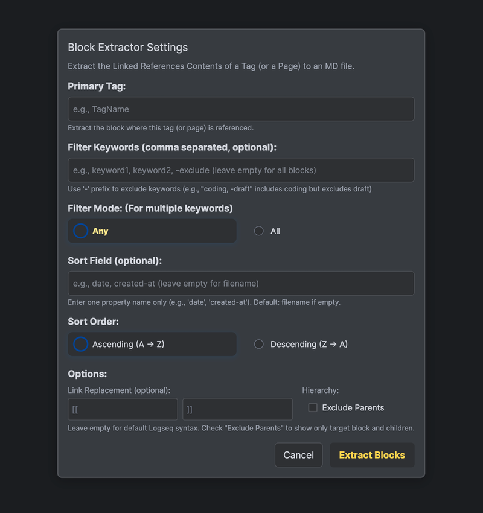

### [ENGLISH](README.md)

# Block Extractor Plugin for Logseq


   


  

## 개요

**Block Extractor Plugin**는 Logseq의 페이지 하단에서 볼 수 있는 **"Linked References"의 내용을 추출하여 Markdown파일로 내보낼 수 있도록 도와주는 플러그인**입니다. 특정 태그(또는 페이지)를 참조하는 모든 블록을 계층 구조를 유지하며 추출합니다. 기본 태그 또는 페이지(primary tag)와 선택적으로 필터 키워드를 입력하면, Logseq 데이터베이스 쿼리를 통해 해당 태그(또는 페이지)를 참조하는 블록(하위 블록 포함)을 모두 가져오고, 키워드가 있으면 해당 키워드를 포함하는 블록만 필터링합니다. 이는 마치 Logseq 페이지 하단의 "Linked References"에서 설정하는 필터 기능과 거의 유사합니다. 최종 결과는 Markdown 형식으로 생성되어 다운로드할 수 있습니다. 이 플러그인을 통해 Logseq 그래프에서 원하는 내용을 빠르고 쉽게 수집, 정리, 공유할 수 있습니다.

> **개인적인 의견:**  
> Logseq를 사용하는 가장 큰 이유는 바로 이 "Linked References" 기능입니다. 이 강력한 기능은 아쉽게도 그 내용을 오롯이 추출할 수 없다는 단점이 있습니다. 이에 수작업으로 참조된 블록을 복사해 붙여넣기할 필요 없이 플러그인으로 간단하게 관련 노트나 프로젝트 단편을 신속하게 모을 수 있습니다. 특히 키워드 기반 계층 필터링 기능 덕분에 필요한 정보만 정확히 추출할 수 있어, 불필요한 정보를 걸러내는 데 큰 도움이 됩니다. 이는 Logseq에서 백링크로 쌓아온 가치있는 정보들을 쉽고 가볍게 추출하여, 더욱 정확하고 더 적은 토큰 비용으로 AI 분석 및 정리를 의뢰할 수도 있습니다.

---

  

## 주요 기능

1. **태그 기반 추출**
    - 지정한 기본 태그(primary tag) 또는 페이지를 참조하는 블록을 자동으로 검색합니다.
    - 하위 블록까지 모두 포함하여 계층 구조를 유지한 상태로 추출합니다.

2. **선택적 키워드 필터링**
    - 쉼표로 구분된 키워드 목록을 입력할 수 있습니다.
    - 키워드 중 하나 이상을 포함하는 블록(또는 해당 블록의 자손)들이 결과에 포함됩니다.
    - 키워드가 2개 이상이면, 쉼표로 구분하며 키워드간 AND, OR 조건을 설정할 수 있습니다.
    - 키워드 앞에 -(하이픈)을 붙이면, 해당 키워드는 제외 필터로 동작합니다.
    - 필터 키워드를 비워두면, 기본 태그를 참조하는 모든 블록(및 하위 블록)을 추출합니다.

3. **Markdown 내보내기**
    - 최신 생성 순서(생성 시점이 최신인 순서)대로 정렬된 블록을 Markdown 파일(`.md`)로 생성합니다.
    - `PrimaryTag_filtered_keyword1_keyword2.md` 또는 키워드가 없으면 `PrimaryTag_all_blocks.md`라는 이름으로 자동 다운로드됩니다.


## 특징

- **자동완성 목록 지원**
    - 두 글자 이상 입력시 해당하는 페이지의 이름이 자동완성 목록으로 나타납니다.
    - 이는 Logseq의 편집기능 중 `[[`로 시작한 후 나타나는 목록과 동일합니다.
    - Primary Tag, Filter Keywords의 입력창에서는, 모든 페이지에 대한 자동완성을 지원합니다. (영어, 한국어 등 지원)
    - Sort Field에서는 Property만 지원합니다.
        - (예시, 페이지에서 `date:: [[2025_06_05]]` 와 같이 `::`를 이용해 key와 value로 사용하였다면 그 key는 모두 `property`가 됩니다. )
- **다양한 실행 방법**
    - 커맨드 팔레트에서 호출 가능
    - 단축키 설정 가능
    - 에디터 내 슬래시 명령어(`/Extract Filtered Blocks`).
    - 툴바 버튼 추가로 클릭 한 번에 실행 가능.
- **다운로드 진행시, 파일명  제안**
    - Markdown 파일 다운로드 시, 기본 태그 및 필터링한 키워드, 정렬 방법을 기본 파일명으로 제안합니다.
- **다크모드 지원**
    - Logseq의 기본 색상 상수를 사용하였기 때문에 대부분의 테마에서도 다크모드를 지원합니다.
- **하위 계층의 경우 10 단계까지 지원**
    - 추출하려는 내용 중 하위블럭이 있을 경우, 하위계층의 최대 깊이 값은 10으로 설정되어있습니다.
    - 이를 따로 사용자 설정할 수 있도록 하는 기능은 추후에 추가할 계획입니다.

---

## 설치 방법

1. **Logseq 플러그인 마켓 플레이스에서 설치 (추천)**
    - Logseq Plugin - Marcketplace 에서 **logseq-block-extractor** 검색 후, 설치

2. **Logseq 플러그인 수동 설치**
    - [github 최신 Release 페이지](https://github.com/inchanS/logseq-block-extractor/releases/latest)에서 최신버전의 `logseq-block-extractor.zip`파일을 다운로드 한 후, 압축을 해제합니다.
    - Logseq - Settings - Advanced - **Developer mode를 활성화**합니다.
        - 
    - Logseq 플러그인을 열면 아래와 같은 화면을 볼 수 있습니다.
        - 
    - 화살표로 표시한 버튼을 누른 후, 아까 다운로드한 **폴더를 클릭**하여 설치합니다.
    - Logseq를 재시작하거나 새로고침하여 플러그인을 로드합니다.

---

## 사용법

1. **플러그인 창 열기**
    - 커맨드 팔레트(`Cmd+shift+P` 또는 `Ctrl+P`)를 열고 **Extract Filtered Blocks**를 검색하거나 설정한 단축키를 누릅니다.
    - 페이지나 저널에서 `/Extract Filtered Blocks`를 입력하고 선택합니다.
    - 툴바 버튼(아이콘)을 클릭하여 다이얼로그를 엽니다.

2. **파라미터 입력**
    - **Primary Tag (필수)**: 검색할 태그 이름만 입력하세요.
        - `#`심볼은 입력하지 않습니다.
        - Primary Tag는 하나만 입력할 수 있습니다.
        - 자동완성 목록에서 선택할 수 있습니다.
        - 예시 : "projectX"
    - **Filter Keywords (선택)**: 필터링하여 참고할 키워드를 입력하세요.
        - 하나 또는 여러 개를 입력할 수 있습니다.
        - 여러개 입력시 '쉼표'로 구분합니다. (예: "issue, resolve, hold")
        - 입력칸을 비워두면 해당 태그를 참조하는 모든 블록을 추출합니다.
        - 키워드 앞에 `-`(하이픈)을 입력하면 해당 키워드의 페이지나 태그는 제외한 블럭만 추출합니다.
        - 자동완성 목록에서 선택할 수 있습니다.
        - 예시 : "issue, resolve, -hold"
            - projectX 페이지를 백링크로 참조하는 모든 블럭들 중 hold 페이지나 태그가 포함된 블럭은 제외합니다. 그리고 그 중에서 issue, resolve 태그나 페이지가 포함된 블럭들을 필터링합니다.
    - **Filter Mode**: 여러 개의 Filter Keywords를 입력하였을 경우의 조건을 설정합니다.
        - **And**: 입력한 모든 키워드를 포함하는 블럭들만 추출합니다.
        - **OR**: 입력한 키워드들 중 하나라도 만족하는 블럭들을 모두 추출합니다.
    - **Sort Field**: 추출한 블럭들의 정렬 기준을 입력합니다.
        - 아무것도 입력하지 않으면 기본적으로 file name(page name)을 기준합니다.
        - 입력창에는 사용자가 해당 Logseq Graph에서 작성해온 모든 property를 지원하며 Logseq의 system property 역시 지원합니다.
        - 주의! Sort Field는 하나만 입력할 수 있습니다. 여러 개를 지원하지 않습니다.
    - **Sort Order**: 정렬 순서를 선택합니다.
        - **Ascending** : 오름차순으로 선택합니다. (A → Z 및 1 → 9 순서입니다.)
        - **Descending** : 내림차순으로 선택합니다. (Z → A 및 9 → 1 순서입니다.)
        - Sort Order 기능은 문자와 숫자 모두 지원합니다.
    - **Link Replacement**: 추출한 블럭에서 Logseq의 링크 문자인 `[[`, `]]`를 바꿀 수 있습니다.
        - Opening Symbol, Closing Symbol에서 각각 `**`를 입력하거나, `==`를 입력하여 볼드체, 하이라이트 등으로 바꿀 수 있습니다.
    - **Hierarchy option**: 상위계층 포함 여부를 선택할 수 있습니다.
        - **Exclude Parents** 체크박스에 체크하면 찾고자 하는 블럭과 그 하위블럭만을 포함합니다.
        - 체크하지 않으면, 직계 상위 블럭을 함께 내보냅니다. 이는 마치 Logseq의 **"Linked References"**과 거의 유사합니다.

3. **추출 실행**

    - **Extract Blocks** 버튼을 클릭합니다.

    - 플러그인은 다음 과정을 거칩니다:

        1. Logseq 데이터베이스에서 기본 태그를 참조하는 블록들을 쿼리합니다.

        2. 각 블록의 전체 내용과 자식 블록을 10계층만큼 가져옵니다.

        3. 필터 키워드가 있을 경우, 재귀적으로 키워드를 포함하는 블록 또는 해당 블록의 자손이 있는지 검사하여 필터링합니다.

        4. 결과를 페이지 생성 시점 기준으로 사전에 설정된 기준으로 정렬합니다.

        5. 각 블록을 페이지 이름(섹션 헤더) 아래에 계층형 목록(들여쓰기된 `-` 표기)으로 정리한 Markdown 문자열을 만듭니다.

        6. 자동으로 `.md` 파일을 다운로드할 수 있는 OS의 창이 나타납니다. 파일명은 다음과 같은 형식입니다:

            ```
            <PrimaryTag>_filtered_<keyword1>_<keyword2>.md
            ```
           또는 키워드가 없으면
            ```
            <PrimaryTag>_all_blocks.md
            ```
           정렬 기준이 있다면
             ```
             <PrimaryTag>_filtered_<keyword1>_<keyword2>_sortBy_<property>.md
             ```
           (제외된 키워드는 파일명에 제안되지 않습니다.)

4. **다운로드된 Markdown 확인**

    - 다운로드된 파일을 마음에 드는 Markdown 뷰어나 텍스트 에디터에서 열어보세요.
    - 추출한 참고내용의 가장 상위 블럭을 기준으로 헤더2단계의 형식으로 정리됩니다.

5. 추출된 Markdown 문서 예시  

```markdown
# Extracting reference blocks project x

Search conditions:
1. "Blocks that reference tags project x"
2. Keep the hierarchy, but show all "issue, resoleved" related blocks and their children
3. Sort by: filename (descending)

A total of 3 blocks found

## 1. apr 14th, 2025

- [[project X]] #resoleved
  - Wow, I finally solved it!!!
    - Here's how I solved it.
      - abcde
        - 가나다라마

---

## 2. apr 12th, 2025

- [[project X]] #issue
  - This is a really serious problem 2.
    - 12345
    - abcde

---

## 3. apr 9th, 2025

- [[project X]] #issue
  - This is a really serious problem.
    - 12345
    - abcde
      - 가나다라마

---


```

---

## 문제 해결

- **“Primary tag is required” 경고**
    - 기본 태그 필수 입력란에 빈 값이 들어갔을 때 발생합니다.
    - 반드시 태그 이름만 입력하세요(예: `할일`, `MeetingNotes`). `#` 기호는 포함하지 않습니다.

- **블록을 찾을 수 없음**
    - **해당 태그를 참조하는 블록이 실제로 있는지 확인하세요.**
    - 키워드 필터를 적용했을 때 결과가 없으면, 필터 없이 다시 시도해 보세요.


---

## 라이선스

이 프로젝트는 **GPL-3.0 LICENSE**와 함께 배포됩니다. 원작자 명시 및 소스코드 공개, 동일 라이센스하에 자유롭게 사용, 수정, 배포하실 수 있습니다.  