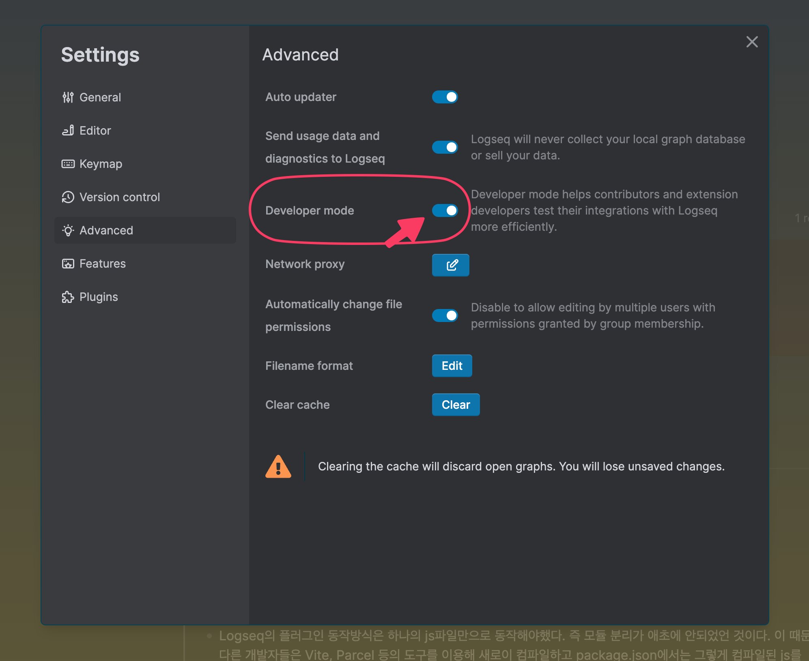
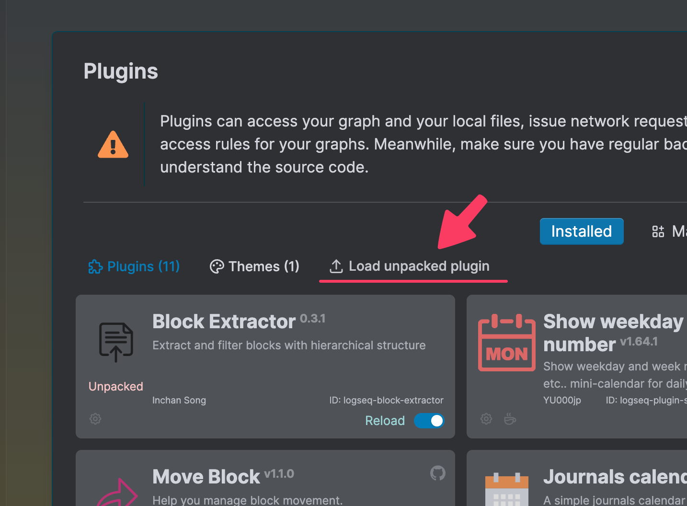

### [한국어](README-KR.md)

# Block Extractor Plugin for Logseq


   


## Overview

The **Block Extractor** plugin is a plugin that allows you to **extract things like the “linked references”** you see at the bottom of a page and **export them to a markdown file**. It extracts all blocks referencing a specific tag (or page), maintaining their hierarchical structure. When you enter a primary tag or page, and optionally filter keywords, the plugin queries the Logseq database to collect all blocks (including their children) referencing the tag or page. If keywords are entered, only the blocks (and their descendants) containing those keywords are filtered in. This process closely mirrors the filtering options in Logseq's "Linked References" section. The final output is generated as a Markdown file, ready for download. With this plugin, you can quickly gather, organize, and share exactly what you need from your Logseq graph.

> **Personal Note:**
> The main reason I use Logseq is this powerful "Linked References" feature. However, one limitation is that you can't easily extract its contents entirely. With this plugin, instead of copying blocks manually, you can rapidly collect relevant notes or project snippets. The keyword-based hierarchical filtering makes it easy to extract only the needed information while filtering out the unnecessary. This enables you to effortlessly extract your valuable, backlink-driven knowledge and, if needed, share it or request AI analysis at a lower token cost.

---


## Main Features

1. **Tag-based Extraction & Include Body Option**
    - Automatically searches for blocks referencing a specified primary tag or page (matched case-insensitively).
    - Extracts blocks while maintaining the full hierarchical structure, including all child blocks.
    - You can also choose to append the **full original content of the Primary Tag document** to the top of the exported results.
2. **Optional Keyword Filtering**
    - Enter a comma-separated list of keywords.
    - Any block (or descendent) including at least one keyword is included in the results.
    - When entering two or more keywords (comma-separated), you can set the filtering logic to **All** (AND) or **Any** (OR) between keywords.
    - If you precede a keyword with a `-` (hyphen), that keyword acts as an exclusion filter.
    - If filter keywords are left blank, all blocks (with descendants) referencing the primary tag are extracted.
3. **Markdown Export & Auto Text Formatting**
    - Blocks are sorted by page name by default — or by any property you choose — and exported as a Markdown file (`.md`).
    - Automatically cleans up Logseq-specific metadata (like `logseq.order-list-type:: number`) and cleanly converts them to standard Markdown ordered lists (`1. `) for perfect compatibility with other markdown editors.
    - **(New in 2.0!)** Flexible link formatting: by default, `[[links]]` are converted to **bold** text. You can enter custom opening/closing symbols (e.g., `==` for highlight), enter `[[` and `]]` to keep the original Logseq syntax, or check **Plain text** to strip the brackets entirely (`[[abc]]` → `abc`).
    - The file is automatically downloaded and is named `PrimaryTag_filtered_keyword1_keyword2.md` (or `PrimaryTag_all_blocks.md` if no keywords are used).
4. **(New in 2.0!) Full Keyboard Workflow**
    - Open the dialog with **`Cmd+Shift+E`** (macOS) / **`Ctrl+Shift+E`** (Windows/Linux), run extraction with **`Cmd/Ctrl+Enter`**, close with **`Esc`** — a complete extraction without ever touching the mouse.
    - A clear accent-colored focus ring shows exactly where you are while Tab-cycling, and shortcut hints are displayed right on the buttons.
5. **(New in 2.0!) Remembers Your Last Settings**
    - Every input is saved when you run an extraction and prefilled the next time the dialog opens.
    - Re-run your previous extraction with just two actions: open the dialog → `Cmd/Ctrl+Enter`.
    - On first use, the Primary Tag defaults to the page you are currently viewing.

## Features

- **Autocomplete Support**
    - When you enter at least two characters, matching page titles appear in an autocomplete list (supports English, Korean, etc.).
    - This is identical to the list that appears when you type `[[` in Logseq's editor.
    - Autocomplete is available for both the Primary Tag and Filter Keywords fields.
    - For the Sort By field, only properties are suggested.
        - (Example: if you used `date:: [[2025_06_05]]` in a page, the key becomes a property.)
- **Redesigned Compact Dialog (2.0)**
    - Frequently used fields (tag, keywords, sort) are up front; less-used options (link replacement, hierarchy toggles) are collapsed into an **Advanced** section.
    - When collapsed, small chips on the Advanced header summarize its current settings at a glance (e.g., `links: bold`, `no parents`).
    - A **live filename preview** at the bottom shows the exact name of the file you are about to export.
- **Various Execution Methods**
    - Command Palette, with the default shortcut `Cmd/Ctrl+Shift+E` (customizable in Logseq Settings → Keymap).
    - Available as a slash command in the editor (`/Extract Filtered Blocks`).
    - Toolbar button for one-click access.
    - Block context menu (right-click a block bullet).
- **Dark Mode Support**
    - All colors follow Logseq's theme variables, so the dialog always matches your current Logseq theme — light, dark, or custom.
- **Supports Up to 10 Hierarchy Levels**
    - Extracted child blocks go up to a depth of 10.
    - (A setting for custom depth is planned for a future release.)

---

## How to Install

1. **Official Plugin Marketplace (recommended)**
    - Search for **logseq-block-extractor** in the Logseq Plugin Marketplace, install.

2. **Manual Installation**
    - Download the latest `logseq-block-extractor.zip` from the [GitHub Releases page](https://github.com/inchanS/logseq-block-extractor/releases/latest) and unzip it.
    - In Logseq, open Settings > Advanced and **enable Developer mode.**
        - 
    - Open the Logseq Plugins menu as shown below.
        - 
    - Click the arrow button, select the extracted **folder** to install.
    - Restart or refresh Logseq to load the plugin.

---

## How to Use

1. **Open the Plugin Dialog**
    - Press the default shortcut **`Cmd+Shift+E`** (macOS) / **`Ctrl+Shift+E`** (Windows/Linux).
    - Or open the Command Palette (`Cmd+Shift+P` or `Ctrl+P`) and search for **Extract Filtered Blocks**.
    - Or in any page or journal, enter `/Extract Filtered Blocks` and select it.
    - Or click the toolbar button/icon.
    - The dialog opens with your last-used settings prefilled (on first use, the Primary Tag is set to the current page). The prefilled tag is preselected, so you can either type immediately to replace it or press `Cmd/Ctrl+Enter` to re-run the previous extraction as-is.
2. **Enter Parameters**
    - **Primary Tag (required):** Enter the tag name to search.
        - Do not include the `#` symbol.
        - Only one primary tag can be entered.
        - Use the autocomplete list to select.
        - Example: "projectX"
    - **Filter Keywords (optional):** Enter keywords to filter blocks.
        - You can enter one or multiple keywords, separated by commas (e.g., "issue, resolve, hold").
        - Leave blank to extract all blocks referencing the tag.
        - Prefix a keyword with `-` (hyphen) to exclude blocks containing that tag or page.
        - Use the autocomplete list to select.
        - Example: "issue, resolve, -hold"
            - This excludes blocks containing "hold" from all blocks referencing "projectX", then filters for those containing "issue" or "resolve".
    - **Any / All (next to Filter Keywords):** Sets the condition if multiple keywords are entered.
        - **Any:** All blocks containing at least one of the keywords are extracted (OR).
        - **All:** Only blocks including all entered keywords are extracted (AND).
    - **Sort By:** Set the sorting property for the extracted blocks.
        - If left blank, defaults to file name (page name).
        - Supports all properties used in your Logseq graph, as well as system properties.
        - Note: Only one sort field is supported.
    - **A→Z / Z→A (next to Sort By):** Choose the sorting order.
        - **A→Z:** Ascending (A → Z or 1 → 9).
        - **Z→A:** Descending (Z → A or 9 → 1).
        - Both alphabetic and numeric sorting are supported.
    - **Advanced (collapsed by default):** Click the header — or press `Enter`/`Space` while it is focused — to expand. When collapsed, chips on the header show its current settings.
        - **Link Replacement:** Controls how Logseq links `[[...]]` appear in the exported file.
            - Leave both fields empty to use the default: links become **bold** (`**...**`).
            - Enter your own symbols (e.g., `==` and `==` for highlight) to customize.
            - Enter `[[` and `]]` to keep the original Logseq syntax.
        - **Plain text:** Check this to remove the brackets entirely (`[[abc]]` → `abc`). The replacement fields are disabled while this is checked.
        - **Exclude Parents:** Check this to include only the targeted block and its children. If unchecked, it will export the parent blocks together (similar to Logseq's "Linked References" view).
        - **Include Tag Body:** Check this to extract the full original content of the Primary Tag (page) itself and append it to the top of the exported file.
    - **Filename Preview:** The exact filename of the export is previewed live at the bottom of the dialog as you type.
3. **Run Extraction**
    - Press **`Cmd/Ctrl+Enter`** or click the **Extract** button.
    - The plugin will:

        1. Query the Logseq database for blocks referencing the primary tag.
        2. Gather each block’s content and up to 10 levels of child blocks.
        3. If filter keywords are set, recursively filter blocks or their descendants that contain the keywords.
        4. Sort results according to the chosen criteria.
        5. Format each block into a hierarchical indented Markdown string (auto-cleaning Logseq properties), grouped under a section header with the page name.
        6. Prompt you to download a `.md` file. Filename examples:

```
<PrimaryTag>_filtered_<keyword1>_<keyword2>.md
```

If no keywords:

```
<PrimaryTag>_all_blocks.md
```

If a sort field is set:

```
<PrimaryTag>_filtered_<keyword1>_<keyword2>_sortBy_<property>.md
```

(Excluded keywords are not shown in the filename.)

4. **Review the Downloaded Markdown**
    - Open the downloaded file with your favorite Markdown viewer or text editor.
    - Extracted content is organized using H2 headers for top-level blocks.
5. **Sample Extracted Markdown Document** (with the default link formatting, `[[links]]` are exported as **bold**)
```markdown
# Extracting reference blocks project x

Search conditions:
1. "Blocks that reference tags project x"
2. Keep the hierarchy, but show all "issue, resolved" related blocks and their children
3. Sort by: filename (descending)

A total of 3 blocks found

### Content of **project X**

- This is the original content of the project X page.
1. Ordered list item 1
2. Ordered list item 2
- Normal bullet point

---

## 1. Apr 14th, 2025

- **project X** #resolved
  - Wow, I finally solved it!!!
    - Here's how I solved it.
      - abcde
        - 가나다라마

---

## 2. Apr 12th, 2025

- **project X** #issue
  - This is a really serious problem 2.
    - 12345
    - abcde

---

## 3. Apr 9th, 2025

- **project X** #issue
  - This is a really serious problem.
    - 12345
    - abcde
      - 가나다라마

---
```

---

## Keyboard Shortcuts

| Key | Action |
| --- | --- |
| `Cmd/Ctrl+Shift+E` | Open the dialog (customizable in Logseq Settings → Keymap) |
| `Tab` / `Shift+Tab` | Move between fields (a visible focus ring shows the current position) |
| `←` `→` | Switch options within Any/All and A→Z/Z→A |
| `↑` `↓` + `Enter` | Navigate and select autocomplete suggestions |
| `Enter` / `Space` | Expand or collapse the Advanced section (while it is focused) |
| `Space` | Toggle checkboxes |
| `Cmd/Ctrl+Enter` | Run extraction (works from anywhere in the dialog) |
| `Esc` | Close the autocomplete list first, then the dialog |

> Note: `Enter` alone does **not** run the extraction — this prevents accidental exports while typing. Use `Cmd/Ctrl+Enter`.

---

## Troubleshooting

- **"Primary tag is required" Warning**
    - This appears if the primary tag input is empty. You must enter only the tag or page name (e.g., `todo`, `MeetingNotes`). Do not include the `#` symbol.
- **No Blocks Found**
    - Make sure there actually are blocks referencing the tag/page.
    - If no results appear with filter keywords, try again without filters.
- **The `Cmd/Ctrl+Shift+E` shortcut doesn't work**
    - Another plugin or system shortcut may be using the same key. You can change the binding in Logseq Settings → Keymap.

---

## License

This project is distributed under the **GPL-3.0 LICENSE**. You are free to use, modify, and distribute it under the same license, provided you credit the original author and publish any changes under the same terms.
