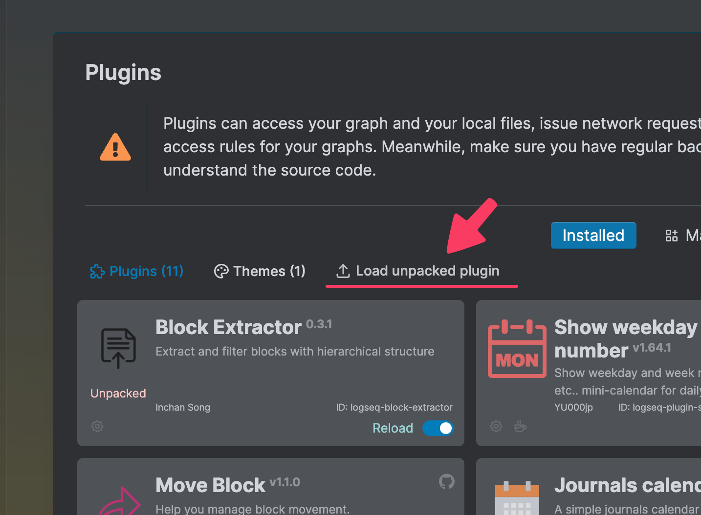

### [한국어](README-KR.md)

# Block Extractor Plugin for Logseq

   

## Overview

The **Block Extractor Plugin** enables you to extract the content of "Linked References" at the bottom of a Logseq page and export it as a Markdown file. It extracts all blocks referencing a specific tag (or page), maintaining their hierarchical structure. When you enter a primary tag or page, and optionally filter keywords, the plugin queries the Logseq database to collect all blocks (including their children) referencing the tag or page. If keywords are entered, only the blocks (and their descendants) containing those keywords are filtered in. This process closely mirrors the filtering options in Logseq's "Linked References" section. The final output is generated as a Markdown file, ready for download. With this plugin, you can quickly gather, organize, and share exactly what you need from your Logseq graph.

> **Personal Note:**
> The main reason I use Logseq is this powerful "Linked References" feature. However, one limitation is that you can't easily extract its contents entirely. With this plugin, instead of copying blocks manually, you can rapidly collect relevant notes or project snippets. The keyword-based hierarchical filtering makes it easy to extract only the needed information while filtering out the unnecessary. This enables you to effortlessly extract your valuable, backlink-driven knowledge and, if needed, share it or request AI analysis at a lower token cost.

---

 

## Main Features

1. **Tag-based Extraction**
    - Automatically searches for blocks referencing a specified primary tag or page.
    - Extracts blocks while maintaining the full hierarchical structure, including all child blocks.
2. **Optional Keyword Filtering**
    - Enter a comma-separated list of keywords (supports Korean, English, etc.).
    - Any block (or descendent) including at least one keyword is included in the results.
    - When entering two or more keywords (comma-separated), you can set the filtering logic to AND or OR between keywords.
    - If you precede a keyword with a `-` (hyphen), that keyword acts as an exclusion filter.
    - If filter keywords are left blank, all blocks (with descendants) referencing the primary tag are extracted.
3. **Markdown Export**
    - Blocks are sorted in reverse chronological order (most recently created first) and exported as a Markdown file (`.md`).
    - The file is automatically downloaded and is named `PrimaryTag_filtered_keyword1_keyword2.md` (or `PrimaryTag_all_blocks.md` if no keywords are used).

## Features

- **Autocomplete Support**
    - When you enter at least two characters, matching page titles appear in an autocomplete list.
    - This is identical to the list that appears when you type `[[` in Logseq's editor.
    - Autocomplete is available for both the Primary Tag and Filter Keywords fields.
    - For the Sort Field, only properties are suggested.
        - (Example: if you used `date:: [[2025_06_05]]` in a page, the key becomes a property.)
- **Various Execution Methods**
    - Can be triggered from the Command Palette.
    - Keyboard shortcuts can be configured.
    - Available as a slash command in the editor (`/Extract Filtered Blocks`).
    - Toolbar button for one-click access.
- **Filename Suggestion During Download**
    - When downloading the Markdown, the default filename will include the primary tag, any filter keywords, and sort options.
- **Dark Mode Support**
    - Uses Logseq's color constants, so it is compatible with dark mode in most themes.
- **Supports Up to 10 Hierarchy Levels**
    - Extracted child blocks go up to a depth of 10.
    - (A setting for custom depth is planned for a future release.)

---

## How to Install

1. **Manual Installation**
    - Download the latest `logseq-block-extractor.zip` from the [GitHub Releases page](https://github.com/inchanS/logseq-block-extractor/releases/latest) and unzip it.
    - In Logseq, open Settings > Advanced and **enable Developer mode.**
      - 
    - Open the Logseq Plugins menu as shown below.
      - 
    - Click the arrow button, select the extracted **folder** to install.
    - Restart or refresh Logseq to load the plugin.
2. **Official Plugin Marketplace (coming soon)**
    - Search for **Block Extractor Plugin** in the Logseq Plugin Marketplace, install, and then restart/refresh Logseq.

---

## How to Use

1. **Open the Plugin Dialog**
    - Open the Command Palette (`Cmd+Shift+P` or `Ctrl+P`), search for **Extract Filtered Blocks**, or use a configured shortcut.
    - In any page or journal, enter `/Extract Filtered Blocks` and select it.
    - Click the toolbar button/icon to open the dialog.
2. **Enter Parameters**
    - **Primary Tag (required):** Enter the tag name to search.
        - Do not include the `#` symbol.
        - Only one primary tag can be entered.
        - Use the autocomplete list to select.
        - Example: "projectX"
    - **Filter Keywords (optional):** Enter keywords to filter blocks.
        - You can enter one or multiple keywords, separated by commas (e.g., "issue, resolve, hold").
        - Leave blank to extract all blocks referencing the tag.
        - Prefix a keyword with `-` (hyphen) to exclude blocks containing that tag or page.
        - Use the autocomplete list to select.
        - Example: "issue, resolve, -hold"
            - This excludes blocks containing "hold" from all blocks referencing "projectX", then filters for those containing "issue" or "resolve".
    - **Filter Mode:** Set the condition if multiple keywords are entered.
        - **AND:** Only blocks including all entered keywords are extracted.
        - **OR:** All blocks containing at least one of the keywords are extracted.
    - **Sort Field:** Set the sorting property for the extracted blocks.
        - If left blank, defaults to file name (page name).
        - Supports all properties used in your Logseq graph, as well as system properties.
        - Note: Only one sort field is supported.
    - **Sort Order:** Choose the sorting order.
        - **Ascending:** A → Z or 1 → 9.
        - **Descending:** Z → A or 9 → 1.
        - Both alphabetic and numeric sorting are supported.
3. **Run Extraction**
    - Click the **Extract Blocks** button.
    - The plugin will:

4. Query the Logseq database for blocks referencing the primary tag.
5. Gather each block’s content and up to 10 levels of child blocks.
6. If filter keywords are set, recursively filter blocks or their descendants that contain the keywords.
7. Sort results according to the chosen criteria.
8. Format each block into a hierarchical indented Markdown string, grouped under a section header with the page name.
9. Prompt you to download a `.md` file. Filename examples:

```
<PrimaryTag>_filtered_<keyword1>_<keyword2>.md
```

If no keywords:

```
<PrimaryTag>_all_blocks.md
```

If a sort field is set:

```
<PrimaryTag>_filtered_<keyword1>_<keyword2>_sortBy_<property>.md
```

(Excluded keywords are not shown in the filename.)
1. **Review the Downloaded Markdown**
    - Open the downloaded file with your favorite Markdown viewer or text editor.
    - Extracted content is organized using H2 headers for top-level blocks.
2. **Sample Extracted Markdown Document**
```markdown
# Extracting reference blocks project x

Search conditions:
1. "Blocks that reference tags project x"
2. Keep the hierarchy, but show all "issue, resolved" related blocks and their children
3. Sort by: filename (descending)

A total of 3 blocks found

## 1. Apr 14th, 2025

- [[project X]] #resolved
  - Wow, I finally solved it!!!
    - Here's how I solved it.
      - abcde
        - 가나다라마

---

## 2. Apr 12th, 2025

- [[project X]] #issue
  - This is a really serious problem 2.
    - 12345
    - abcde

---

## 3. Apr 9th, 2025

- [[project X]] #issue
  - This is a really serious problem.
    - 12345
    - abcde
      - 가나다라마

---
```


---

## Troubleshooting

- **"Primary tag is required" Warning**
    - This appears if the primary tag input is empty. You must enter only the tag or page name (e.g., `todo`, `MeetingNotes`). Do not include the `#` symbol.
- **No Blocks Found**
    - Make sure there actually are blocks referencing the tag/page.
    - If no results appear with filter keywords, try again without filters.

---

## License

This project is distributed under the **GPL-3.0 LICENSE**. You are free to use, modify, and distribute it under the same license, provided you credit the original author and publish any changes under the same terms.

